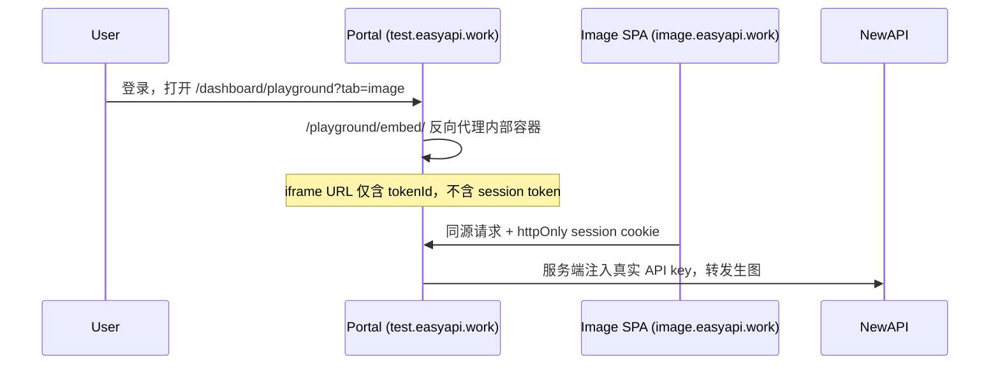

# 生图 Playground 嵌入安全

本文档说明 Portal 与独立部署的 `gpt_image_playground`（例如 `https://image.easyapi.work`）之间的安全边界，以及基础设施侧必须完成的配置。

## 架构概览



## Portal 侧已实现

| 能力 | 说明 |
|------|------|
| 真实密钥隔离 | NewAPI `sk-*` 仅在 Portal 服务端解析，不进入 iframe URL、响应体或浏览器日志 |
| 同源代理 | `IMAGE_PLAYGROUND_INTERNAL_URL` 启用后，iframe 走 `/playground/embed/`，URL 不含 session token，依赖 httpOnly `portal_session` |
| 代理直连防护 | middleware 阻止未登录访问 embed；顶层直接打开 `/playground/embed` 返回 404（仅允许从 `/dashboard/playground` iframe 加载） |
| Portal CSP | `frame-src` 限制可嵌入来源；`frame-ancestors 'self'` 防止 Portal 被第三方嵌套 |
| iframe referrer | `referrerPolicy="no-referrer"` 降低 token 经 Referer 泄漏风险 |

## image.easyapi.work 基础设施必须配置

`image.easyapi.work` **不在本仓库**，需在 nginx / Cloudflare / 容器入口单独加固。

### 1. 禁止独立直接访问（仅允许被 Portal iframe 嵌入）

在 `image.easyapi.work` 响应头添加：

```nginx
# nginx 示例
add_header Content-Security-Policy "frame-ancestors https://test.easyapi.work https://easyapi.work" always;
add_header X-Frame-Options "ALLOW-FROM https://test.easyapi.work" always;  # 旧浏览器；现代浏览器以 CSP 为准
```

Cloudflare Transform Rules 示例：

```
Set static header: Content-Security-Policy = frame-ancestors https://test.easyapi.work;
```

将 `https://test.easyapi.work` 替换为实际 Portal 域名（生产、staging 可逗号分隔多个 origin）。

效果：用户在地址栏直接打开 `https://image.easyapi.work/` 时，页面可加载但**无法被当作独立产品使用**（若再配合下方 Access 可完全阻断）。

### 2. （可选）Cloudflare Access / IP 限制

若 playground 仅需 Portal 服务器与用户浏览器访问：

- 对 `image.easyapi.work` 启用 Cloudflare Access，仅允许 Portal 运维 IP + 已认证用户；或
- 在源站防火墙仅允许 Cloudflare 回源 IP。

此为纵深防御，与 `frame-ancestors` 互补。

### 3. 禁止缓存带 token 的 URL

```nginx
location / {
  add_header Cache-Control "no-store" always;
}
```

避免 CDN/浏览器缓存 `?apiKey=portal-image-session-v1...` 类 URL。

### 4. CORS 无需配置

生图 API 请求发往 **Portal 域**（`apiUrl` / `imageApiUrl` 指向 Portal），且通过同源 iframe 使用 Portal session。`image.easyapi.work` 本身不应对外提供 OpenAI 兼容 API，Portal 也不为外部 playground origin 返回 CORS allow origin。

## 环境变量对照

| 变量 | 作用 |
|------|------|
| `IMAGE_PLAYGROUND_INTERNAL_URL` | 同源代理上游（runtime），如 `http://image-playground-test` |
| `AUTH_SECRET` | 签名 image session token（≥32 字符） |

**推荐生产拓扑**：Portal 与 playground 容器同 compose，`IMAGE_PLAYGROUND_INTERNAL_URL` 走内网，**不暴露** `image.easyapi.work` 公网。

## 威胁与缓解

| 威胁 | 缓解 |
|------|------|
| 用户直接访问 image 子域 | `frame-ancestors` +（可选）Cloudflare Access |
| 共享浏览器 / 历史记录中的 URL token | 同源代理模式不在 URL 放 token |
| Bearer token 被盗用 | 同源代理不向 iframe URL 签发 Bearer token；非浏览器场景仍需保护 `AUTH_SECRET` |
| 真实 API key 泄漏 | 仅服务端 `resolvePlaygroundKey` 注入上游 |
| Portal 被第三方嵌套钓鱼 | Portal `frame-ancestors 'self'` |

## 验证清单

- [ ] `curl -I https://image.easyapi.work/` 含正确 `Content-Security-Policy: frame-ancestors ...`
- [ ] 在 Portal 登录后 `/dashboard/playground?tab=image` 可看到 iframe
- [ ] 地址栏直接打开 `https://image.easyapi.work/` 无法脱离 Portal 独立使用（或 Access 阻断）
- [ ] iframe URL 不含 `sk-*`、`portal-token-*` 或 `portal-image-session-v1.*`
- [ ] `curl -X OPTIONS https://<portal>/v1/images/generations -H "Origin: https://image.easyapi.work"` 不返回 `Access-Control-Allow-Origin`
